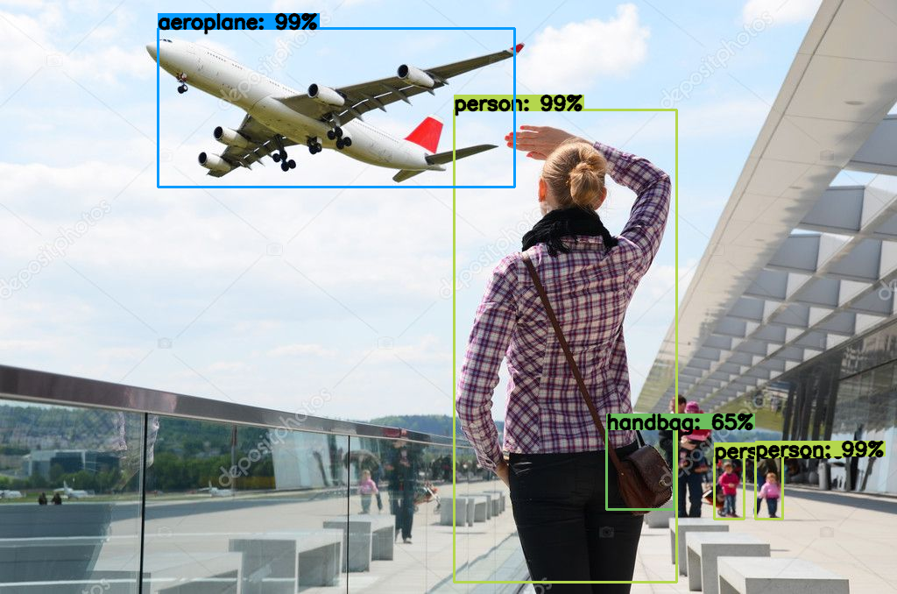
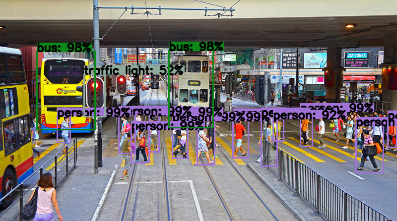

# YOLOv3

[](https://travis-ci.com/MiG98789/tensorflow-yolov3)
[](https://codecov.io/gh/MiG98789/tensorflow-yolov3)

A TensorFlow implementation of YOLOv3.

Reference: [YOLOv3: An Incremental Improvement](https://pjreddie.com/media/files/papers/YOLOv3.pdf)

# Development Environment

This was developed with the following environment:

* Ubuntu 16.04
* CUDA Toolkit 9.0
* cuDNN SDK v7.0
* NVIDIA GPU Driver 390.59
* Python 3.5
* All Python packages listed in ```requirements.txt```

# Setup Guide

The following assumes that you have already set up a virtual environment for Python 3.5. Also, the ```setup.sh``` script has only been tested on Ubuntu 16.04, and not other operating systems.

Follow the instructions for either the CPU or GPU setup, depending on what you want to use.

## CPU

Run ```./setup.sh cpu```.

## GPU

If you want to use your GPU, follow [this link](https://www.tensorflow.org/install/install_linux) to install CUDA and cuDNN for TensorFlow on Linux.

Then, run ```./setup.sh```.

# Usage

To run YOLOv3, type the following in the terminal:

```bash
python main.py <path_to_image_or_video>
```

To run the test cases, type the following in the terminal:

```bash
python run_tests.py
```

# Results



